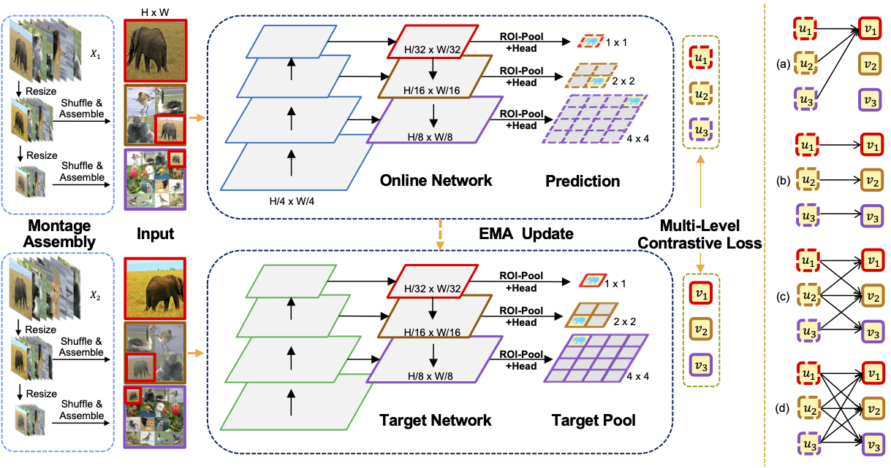

# Introduction

This is the implematation of Multi-Level Contrastive Learning for Dense Prediction Task (MCL). 
Our code is based on Openselfsup. For the installation and data preparation, please refer to the [INSTALL.md](INSTALL.md).




## Pre-train 

Our codebase supports distributed training. All outputs (log files and checkpoints) will be saved to the working directory, which is specified by work_dir in the config file.

```console
./tool/dist_train.sh configs/selfsup/MCL/MCL.py 8
```

The default learning rate in config files is for 32 GPUs and 128 images (batch size = 32*128 = 4096).


The released pre-trained model weights can be found [here](https://connecthkuhk-my.sharepoint.com/:f:/g/personal/u3007956_connect_hku_hk/EjmjnvMAkXpPlFbGjb4srRsBKueThlzZH6ckdMok8_pYzg?e=CwNdXb)


## Finetune

1. Install [Detectron2](https://github.com/facebookresearch/detectron2/tree/f50ec07cf220982e2c4861c5a9a17c4864ab5bfd)
2. Convert the pretrained weights:
   
```console
cd benchmarks/detection;
python convert-sppretrain-to-detectron2.py PATH_TO_PRETRAIN_WEIGHTS.pth PATH_TO_SAVE_D2_WEIGHT.pkl;
python train_net.py \
    --config-file ./configs/coco_R_50_FPN_CONV_1x_moco.yaml --num-gpus 8 \
    --dist-url 'tcp://localhost:10001' MODEL.WEIGHTS PATH_TO_SAVE_D2_WEIGHT.pkl
```
